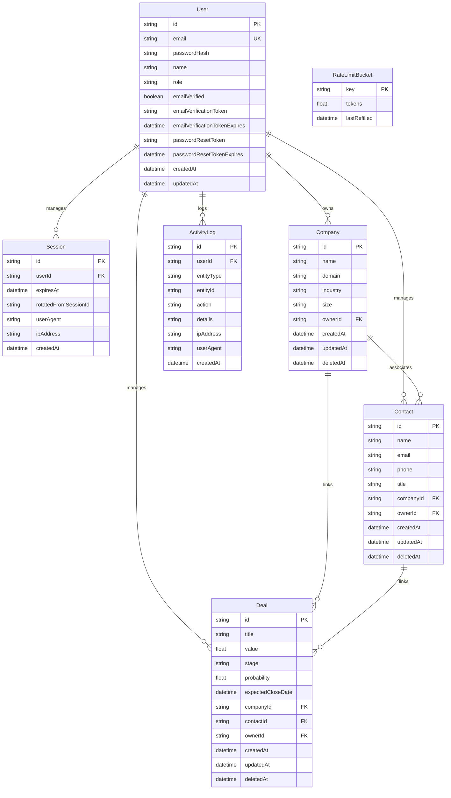

# PipelineIQ Technical Architecture

PipelineIQ is a CRM sales deal pipeline and weighted probability forecasting application designed for B2B revenue operations teams. It is built using Next.js App Router, TypeScript, SQLite, and Prisma ORM.

## Entity Relationship Model

Below is a diagram representing the data models and relationships configured in the database:

## Security & Authentication Architecture

Authentication is powered by a custom database-backed session framework. It fulfills strict B2B security protocols without relying on external SaaS OAuth providers:

1.  **Session Cookie Policies**: Session tokens are randomly generated UUIDs mapped in the `Session` table. They are delivered to the client browser via an `httpOnly`, `Secure` (in production environments), and `SameSite=Lax` cookie (`pipeline_iq_session`) with a 7-day TTL.
2.  **Session Rotation**: The active session ID is rotated during:
    *   Any login operation (preventing Session Fixation attacks).
    *   Any privilege change, such as completing the email verification flow.
3.  **Role-Based Access Control (RBAC)**: Enforced server-side for every mutation. We define four roles:
    *   `OWNER`: Complete read/write settings and destructive actions.
    *   `ADMIN`: Manage all deals, contacts, companies, logs, and user roles.
    *   `MEMBER`: CRUD operations for deals/contacts/companies they manage.
    *   `VIEWER`: Read-only views. All mutation endpoints (POST, PATCH, PUT, DELETE) reject viewer requests server-side with a 403 response.
4.  **Token Bucket Rate Limiting**: All sensitive authentication routes (e.g. login, signup, password reset request) are wrapped in a rate-limiting middleware that uses the database-backed `RateLimitBucket` table to throttle requests by IP address and target account. Throttled requests return a `429 Too Many Requests` status with a `Retry-After` header.
